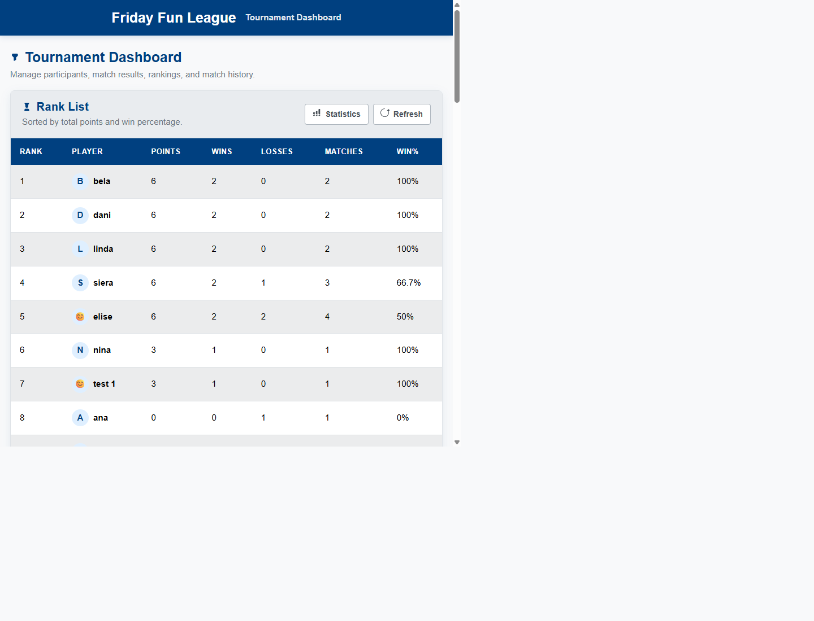
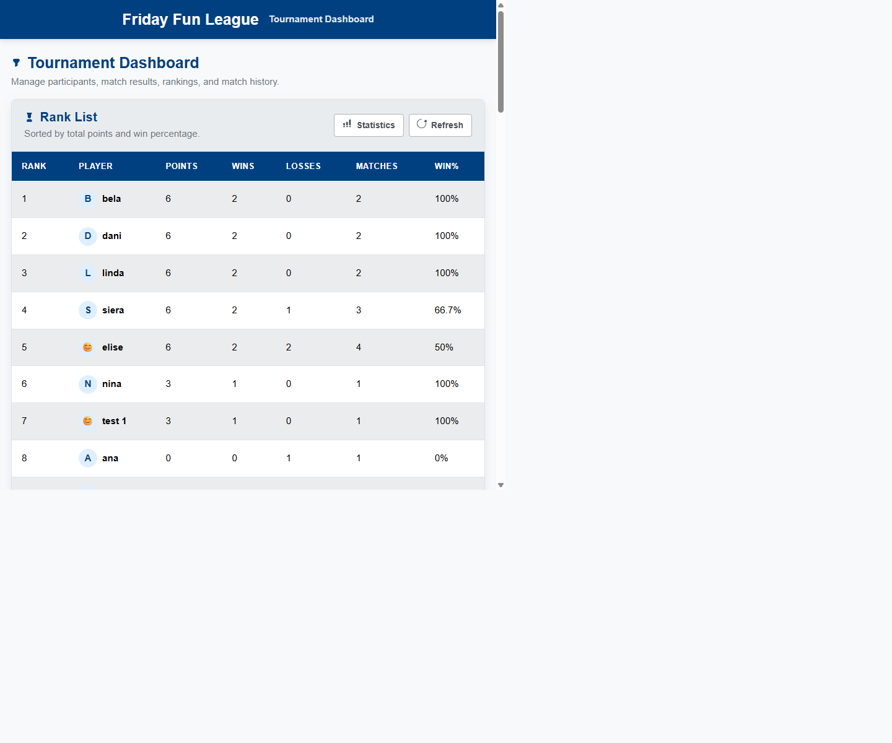

# Friday Fun League

The project is a tournament web app where users can add participants, register matches, view rankings, filter results, and open a statistics page.

## What the app does

- Shows a rank list with name, points, wins, losses, and win percentage
- Loads more rank-list rows with a lazy-loading `Load more` button when the player list gets long
- Shows the latest 10 matches
- Updates the rank list and latest matches with an async refresh button without reloading the whole page
- Loads more match-history rows with a lazy-loading `Load more` button
- Lets the user add, edit, and delete participants
- Lets the user add, edit, and delete matches
- Lets the user search and filter match history
- Shows a separate statistics page with charts and summary information

## Tech used

- Backend: Laravel
- Frontend: Blade + Bootstrap 5
- Build tool: Vite
- Icons: Inline SVG
- Database: MySQL
- Charts: Chart.js
- Tests: PHPUnit

## Why this project uses this stack

I chose Laravel and Blade because they make the project clear and easier to follow.
Bootstrap helped me build the interface faster.
Vite helps prepare the CSS and JavaScript files for the browser.
MySQL stores the participants and match results.

## Versions used

- PHP: 8.2.12
- Laravel: 12.56.0
- MariaDB/MySQL: 10.4.32-MariaDB
- Node.js: 24.15.0
- npm: 11.12.1
- Bootstrap: 5.3.8
- Chart.js: 4.5.1
- Vite: 7.3.2
- Laravel Vite Plugin: 2.1.0
- Tailwind Vite Plugin: 4.2.4
- PHPUnit: 11.5.55


## How to run the project

1. Start Apache and MySQL in XAMPP.
2. Make sure the `.env` file points to your MySQL database.
3. Install dependencies if needed.
4. Run the migrations.
5. Start the Laravel server.

Commands:

```bash
composer install
npm install
php artisan migrate
php artisan serve
```

Open the app at:

```text
http://127.0.0.1:8000
```

## User guide

1. Open the dashboard.
2. Check the rank list to see points, wins, losses, matches, and win percentage.
3. Use `Refresh` if you want the top dashboard data to update without reloading the page.
4. Add a new participant in the `Add Participant` card.
5. Register a new match in the `Register Match` card.
6. Use `Edit` or `Delete` in the management tables if you need to correct saved data.
7. Use the search and filter area to narrow the match history.
8. Open the `Statistics` page to see charts and summary numbers.

Screenshots:





## FAQ

- Why are not all players shown immediately?
	The rank list uses lazy loading, so the page starts smaller and faster.

- What does the `Refresh` button do?
	It updates the top dashboard data in the background and now shows a success toast when the refresh finishes.

- Where can I see app activity?
	Important participant and match actions are written to the `league` log file in `storage/logs`.

- Why do the charts not load instantly?
	The statistics charts use lazy loading, so they load when the chart area is needed.

## How to run the tests

```bash
php artisan test
```

The tests use the Laravel test setup and do not change the real MySQL database.

- Tests are small automatic checks for the app.
- They help make sure important parts still work after changes.
- In this project, tests check things like the dashboard, participants, matches, and filters.
- This helps find mistakes early and makes the project safer to change.

## Logs

Logs are simple notes the app writes about what happened.

This project now uses its own log file for important participant and match actions:

- `storage/logs/league-YYYY-MM-DD.log`

The file is created automatically the first time the app writes to it.

What gets logged:

- participant created
- participant updated
- participant deleted
- match created
- match updated
- match deleted
- failed edit validation for participants and matches

How logs help:

- They help you see what happened in the app.
- They help you debug problems faster.
- They help you check if a form or button really worked.
- They help when you are testing or showing the project to someone.

How to view the log file on Windows:

```bash
type storage\logs\league-2026-04-30.log
```

If the file is long, you can view only the latest lines with:

```bash
powershell -Command "Get-Content storage\\logs\\league-2026-04-30.log -Tail 30"
```

## Project structure

- `app/Http/Controllers` contains the controller logic
- `config` contains app settings, including the logging setup
- `app/Models` contains the database models
- `app/Services` contains the standings recalculation logic
- `resources/css` contains the main app styles
- `resources/js` contains the main frontend scripts
- `resources/views` contains the Blade UI files
- `docs/screenshots` contains screenshots and Lighthouse proof files used in the documentation
- `database/migrations` contains the table definitions
- `tests` contains feature and unit tests

## Diagram images

Exported diagram images are saved in `docs/diagrams`.

- The architecture diagram shows the big picture of the app.
- The MVC diagram shows how Blade, controllers, models, and the service layer work together.
- The sequence diagram shows the flow when a match is registered.
- The ER diagram shows the database tables and their relationship.

## UI design choices

- The page uses a larger `H1` for the main page title and a smaller `H2` for card and section titles.
- This gives a clearer visual hierarchy between the page title and each content block.
- Key actions now use small inline SVG icons, for example `Refresh`, `Statistics`, `Add Participant`, `Register Match`, `Edit`, `Delete`, and `Back to Dashboard`.
- The icons were added in a moderate way so the interface still stays clean and focused on the data.

## Design pattern choices

- `Leaderboard-First Command Center` means the app shows the most important tournament information first.
- `Progressive Disclosure` means extra tools are still available, but they are revealed step by step instead of all at once.
- `Split Workspace Pattern`, used only partial, `Add` and `Manage` tabs.

## Async Refresh

The `Refresh` button is an async feature.

- When the user clicks `Refresh`, the browser asks the server for new rank-list and latest-match data in the background.
- Then the page updates only the top dashboard section without reloading the whole page.
- If the user already loaded more rank-list rows, `Refresh` keeps that larger visible list instead of going back to only the first rows.
- After a successful refresh, the user now sees a small success toast as feedback.

Async refresh means the page updates data that is already on the screen.

## Lazy Loading

The project now uses lazy loading in a few places.

- The first page load shows only the first 10 rank-list rows.
- The first page load shows only the first 10 history rows.
- When the user clicks `Load more` under the rank list, the browser asks the server for the next players in the background.
- When the user clicks `Load more` under match history, the browser asks the server for the next match rows in the background.
- The new rows are added to the same table without reloading the page.
- The statistics page loads the chart scripts only when the chart area is reached.
- The dashboard uses one shared Edit popup. When you click Edit, it fills that popup with the correct data. This is better than loading a hidden popup for every row when the page first opens.

Lazy loading means the page does not load all extra content at the start. It loads more only when it is needed.

## Lighthouse Improvements

Some frontend files were cleaned up to help the Lighthouse score.

Vite is a frontend build tool. It prepares CSS and JavaScript files so the browser can load them in a cleaner and faster way.

- The layout now uses Vite to load the built CSS and JavaScript files.
- Bootstrap CSS is now loaded from the local project files instead of a CDN link.
- The large inline style block was moved into `resources/css/app.css`.
- The large dashboard script was moved into `resources/js/dashboard.js`.
- `resources/js/app.js` now loads only the Bootstrap JavaScript parts the app really uses.
- `resources/js/app.js` also loads the dashboard script only on the dashboard page.
- The statistics page now lazy loads local Chart.js files through Vite instead of loading Chart.js from a CDN.
- Some lower dashboard sections are deferred so the top of the page can show faster.
- Unused Tailwind CSS directives were removed from the main stylesheet to reduce the CSS payload.

Easy explanation:

- The browser gets cleaner frontend files.
- Less code has to be loaded at the start.
- The first visible part of the page can appear faster.
- This helps Lighthouse give a better performance result.

## Lighthouse results

The latest local Lighthouse report is saved in `docs/screenshots/lighthouse-mobile.json`.

Current result:

- Performance: 91
- Accessibility: 91
- Best Practices: 100
- SEO: 91
- First Contentful Paint: 2.8 s
- Time to Interactive: 2.9 s
- Largest Contentful Paint: 2.9 s
- Speed Index: 2.8 s

What this means:

- The project now meets the performance goal above 90 in the latest local mobile-style run.
- Time to Interactive is below 3 seconds in the latest run.
- First Contentful Paint is improved, but in this strict local run it is still above 2 seconds, so that is still one small performance area to improve further.
- Localhost results can also look a bit worse than a real production server because localhost does not use normal production cache and compression settings.

## Simple Difference

- Async refresh updates content that is already on the page.
- Lazy loading loads extra content later instead of loading everything at the beginning.

Examples from this project:

- `Refresh` is async because it updates the rank list and latest matches that are already visible.
- The rank-list `Load more` button is lazy loading because it loads extra player rows only when the user clicks the button.
- `Load more` is lazy loading because it loads extra match-history rows only when the user clicks the button.
- The statistics charts are lazy loaded because the chart scripts are loaded only when the chart section is reached.
- The edit modals are lazy loaded because one shared modal is filled when the user clicks `Edit` instead of loading many hidden modals at page start.

The main files are:

- `DashboardController` prepares the first rank-list rows and first history rows, and returns more rows as JSON.
- `routes/web.php` contains the background routes, including the leaderboard and history load-more routes.
- `dashboard.blade.php` contains the dashboard layout, buttons, shared edit popups, and hidden values used by JavaScript.
- `resources/js/dashboard.js` contains the dashboard JavaScript for `Refresh`, both `Load more` buttons, shared edit popups, and scroll restore.
- `resources/js/app.js` loads the main frontend JavaScript and only the Bootstrap parts the app needs.
- `stats.blade.php`, `resources/js/stats-page.js`, and `resources/js/stats-charts.js` lazy load the statistics charts from local Vite-managed files.

## File Explanations

- `config/logging.php` contains the log channels and now includes a separate `league` log file for app activity.
- `DashboardController.php` loads the dashboard data, statistics data, async refresh data, lazy-loaded rank-list data, and lazy-loaded history data.
- `MatchGameController.php` handles saving, editing, and deleting match results.
- `ParticipantController.php` handles saving, editing, and deleting participants.
- `resources/views/layouts/app.blade.php` loads the built frontend files with Vite.
- `resources/css/app.css` contains the Bootstrap CSS import and the custom app styles.
- `resources/js/app.js` loads the main frontend JavaScript and the needed Bootstrap JavaScript parts.
- `resources/js/dashboard.js` contains the dashboard JavaScript for Refresh, Load more, shared popups, and scroll restore.
- `resources/js/stats-page.js` lazy loads the local chart files when the statistics section is needed.
- `resources/js/stats-charts.js` builds the statistics charts after Chart.js has loaded.
- `dashboard.blade.php` shows the main dashboard page and provides the HTML and hidden data used by the dashboard JavaScript.
- `stats.blade.php` shows the statistics page and provides the hidden data used by the statistics JavaScript.
- `routes/web.php` connects the URLs to the correct controller methods.
- `docs/screenshots` stores the screenshots and Lighthouse JSON report used in this documentation.
- The feature test files check that the main user actions still work correctly.

## Monitoring and event management

The project includes a simple monitoring-style setup through logging.

- Important participant and match actions are written to the `league` log channel.
- Validation failures for edit actions are also logged.
- This makes it easier to track important events during testing and debugging.

Easy explanation:

- This is not a full monitoring platform.
- It is a simple event trail that shows what happened in the app.
- A future improvement would be real monitoring with alerts, uptime checks, and error dashboards.

## Alternative solutions and future improvements

- A React or Vue frontend could be used for a more interactive single-page solution.
- WebSockets or Server-Sent Events could be used instead of a manual refresh button for live updates.
- The app could be deployed behind a web server with compression and stronger cache headers to improve FCP further.
- Login and user roles could be added in a future version.
- More automated frontend tests could be added for browser-side behavior.
- A full monitoring solution could be added instead of only file-based logging.

Easy explanation:

- The current solution is strong for a course project and CRUD-style dashboard.
- These ideas show what could be improved if the project grows larger.

## Conclusion

Laravel, Blade, Bootstrap, and Vite met the expectations for this project.

- Development speed was good because Laravel and Blade made the CRUD flows and server-rendered pages simple to build.
- Data handling was strong because Laravel, Eloquent, and the database structure made it easy to save and update tournament data.
- Performance improved clearly after moving CSS and JavaScript into Vite-managed files, splitting the dashboard and statistics scripts, and reducing unused assets.
- For a project like this, I would still choose this stack again because it is practical, clear, and easy to maintain.
- If I had to build a much more real-time or highly interactive app in the future, I would consider a frontend framework such as React or Vue together with an API-based backend.

## Notes

- No login/authentication is included because it was not required for the assignment.
- The app uses match history as the source of truth for standings.
- A service class is used to recalculate standings after create, edit, and delete actions.
- The `Refresh` button is async because it updates current dashboard data in the background.
- The rank-list `Load more` button uses lazy loading because it loads extra player rows only when the user asks for them.
- The `Load more` button uses lazy loading because it loads extra match-history rows only when the user asks for them.
