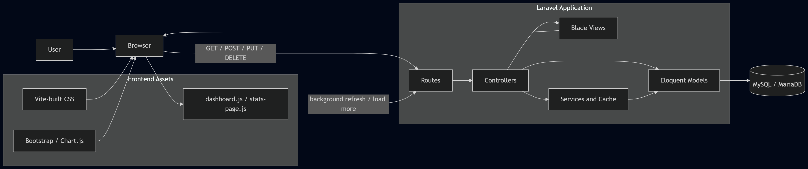
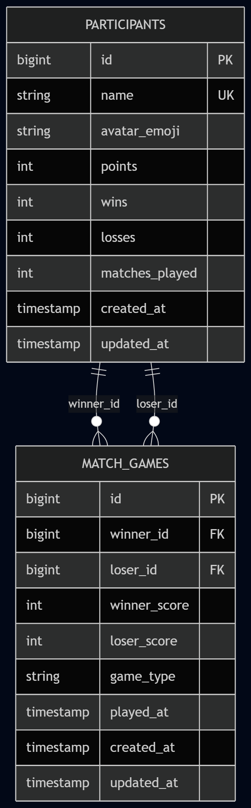
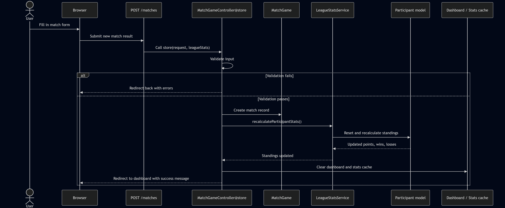

# Friday Fun League

Friday Fun League is a tournament web app where users can add participants, register matches, follow the leaderboard, filter match history, and open a separate statistics page.

## What the app does

- Shows a leaderboard with each player's name, points, wins, losses, matches played, and win percentage
- Loads more leaderboard rows with a lazy-loading `Load more` button when the player list gets long
- Shows the latest 10 matches on the dashboard
- Refreshes the leaderboard and latest matches in the background without reloading the whole page
- Loads more match-history rows with a lazy-loading `Load more` button
- Lets the user add, edit, and delete participants
- Lets the user add, edit, and delete matches
- Lets the user search and filter match history
- Shows a separate statistics page with charts and summary information

## Tech stack

- Backend: Laravel
- Frontend: Blade + Bootstrap 5
- Build tool: Vite
- Database: MySQL / MariaDB
- Charts: Chart.js
- Tests: PHPUnit
- Icons: Inline SVG

## Why this stack

Laravel gives the project a clear structure for routes, controllers, validation, and database work. Blade keeps the frontend simple and easy to follow, which suits a server-rendered app like this. Bootstrap helps with responsive layout and faster UI work, while Vite keeps the CSS and JavaScript build process organized. MySQL stores the tournament data in a relational database, and Chart.js is enough for the statistics page without adding extra complexity.

## Why these choices over alternatives

- Laravel was chosen over a smaller PHP framework because it already includes routing, validation, migrations, and Eloquent
- Blade was chosen over React or Vue because it is easier to manage for a beginner-friendly, server-rendered project
- Bootstrap was chosen over fully custom styling because it provides a fast responsive base for forms, layout, and buttons
- Vite was chosen over CDN-only assets or older build tools because it works well with Laravel and keeps frontend files easier to organize
- MySQL was chosen over SQLite for the main local setup because it fits the XAMPP workflow better for this project
- Chart.js was chosen over heavier chart libraries because it is simple to set up and already covers the statistics page needs

## Versions used

- PHP: 8.4.20 locally (project requirement: ^8.2)
- Laravel: 12.56.0
- Composer: 2.9.7
- MariaDB/MySQL: 10.4.32-MariaDB
- Node.js: 24.15.0
- npm: 11.12.1
- Bootstrap: 5.3.8
- Chart.js: 4.5.1
- Vite: 7.3.2
- Laravel Vite Plugin: 2.1.0
- Tailwind Vite Plugin: 4.2.4
- PHPUnit: 11.5.55

## How to run the project

This project is set up for a local XAMPP MySQL or MariaDB database.

1. Start `MySQL` in XAMPP.
2. Create a database named `friday_fun_league_db` in phpMyAdmin.
3. Copy `.env.example` to `.env` if `.env` does not already exist.
4. Make sure the `.env` file points to your XAMPP MySQL database.
5. Install the project dependencies.
6. Generate the Laravel app key.
7. Run the migrations.
8. Start the Laravel development server.

Recommended `.env` database values for XAMPP:

```env
DB_CONNECTION=mysql
DB_HOST=127.0.0.1
DB_PORT=3306
DB_DATABASE=friday_fun_league_db
DB_USERNAME=root
DB_PASSWORD=
```

Commands for a fresh setup:

```bash
composer install
npm install
copy .env.example .env
php artisan key:generate
php artisan migrate
php artisan serve
```

Optional shortcuts:

```bash
composer setup
npm run dev
npm run build
```

- Use `npm run dev` while you are editing CSS or JavaScript
- Use `npm run build` when you want the final production assets
- Use `composer setup` only after the MySQL database already exists
- If you use `php artisan serve`, Apache from XAMPP is not required
- If you want to use XAMPP Apache instead, do not run Apache and `php artisan serve` for the same project at the same time

Open the app at:

```text
http://127.0.0.1:8000
```

## User guide

1. Open the dashboard.
2. Check the leaderboard to see points, wins, losses, matches, and win percentage.
3. Use `Refresh` if you want the top dashboard data to update without reloading the page.
4. Use the `Add` tab to open the `Add Participant` and `Register Match` tools.
5. Add a new participant or register a new match from that tab.
6. Switch to the `Manage` tab if you need to edit, delete, search, or filter saved data.
7. Use the search and filter area to narrow the match history.
8. Open the `Statistics` page to see charts and summary numbers.

## FAQ

- Why aren't all players shown immediately? The leaderboard uses lazy loading, so the page starts smaller and faster.
- What does the `Refresh` button do? It updates the top dashboard data in the background and shows a success toast when the refresh finishes.
- Where can I see app activity? Important participant and match actions are written to the `league` log files in `storage/logs`.
- Why do the charts not load instantly? The statistics page loads chart scripts only when the chart area is needed.

## How to run the tests

```bash
php artisan test
```

The tests use the Laravel setup in `phpunit.xml` and run with SQLite in memory, so they do not change your real XAMPP MySQL database. They cover the main dashboard and form flows and help catch problems early when the project changes.

## Logs

The project writes important participant and match actions to its own daily log files:

- `storage/logs/league-YYYY-MM-DD.log` for normal app usage
- `storage/logs/league-testing-YYYY-MM-DD.log` during test runs

The files are created automatically the first time the app writes to them. They are useful for confirming what happened during testing, checking whether a form or button worked, and troubleshooting unexpected behaviour.

How to view a log file on Windows:

```bash
type storage\logs\league-2026-04-30.log
```

If the file is long, you can view only the latest lines with:

```bash
powershell -Command "Get-Content storage\\logs\\league-2026-04-30.log -Tail 30"
```

## Project structure

- `app/Http/Controllers` contains the controller logic
- `app/Models` contains the database models
- `app/Services/LeagueStatsService.php` contains the standings recalculation logic
- `config` contains app settings, including the logging setup
- `database/migrations` contains the table definitions
- `resources/css` contains the main app styles
- `resources/js` contains the main frontend scripts
- `resources/views` contains the Blade UI files
- `tests` contains feature and unit tests

## Database and points logic

- `participants` stores each player's name, optional avatar emoji, points, wins, losses, and matches played
- `match_games` stores each saved match, including the winner, loser, score, game type, and played time
- A win gives `3` points and a loss gives `0` points
- The leaderboard is recalculated from match history
- `LeagueStatsService` recalculates points, wins, losses, and matches played after a match is created, edited, or deleted

## Diagram images

Exported diagram images are saved in `docs/diagrams`.

### Architecture overview



This diagram shows the project at a high level: the browser sends requests to Laravel, and Laravel reads from and writes to MySQL.

### MVC structure


This diagram shows how the main Laravel parts work together. Routes send the request to controllers, controllers use models and services, and Blade views return the page to the browser.

### Database ER diagram



This diagram shows the main database tables and how they are connected. `participants` stores player and ranking data, and `match_games` stores each saved match with a winner and a loser.

### Register match sequence diagram



This diagram shows what happens when a user saves a new match result. The app validates the form, saves the match, recalculates the standings, clears the cache, and sends the user back to the dashboard with a success message.

## UI design choices

The dashboard uses a larger `H1` for the main page title and smaller `H2` headings for cards and sections, which makes the page easier to scan. Important actions use small inline SVG icons such as `Refresh`, `Statistics`, `Add Participant`, `Register Match`, `Edit`, `Delete`, and `Back to Dashboard`, so the interface stays clear without feeling heavy.

## Design pattern choices

- Leaderboard-first command center: the most important tournament information is shown first
- Progressive disclosure: extra tools appear only when they are needed, which keeps the page from feeling crowded
- Split workspace pattern: the dashboard separates the `Add` and `Manage` areas so related tasks stay organized

## Async refresh

The `Refresh` button updates the visible leaderboard and latest-match data in the background instead of reloading the whole page. If the user already loaded more leaderboard rows, those rows stay visible, and a small success toast confirms when the update finishes.

## Lazy loading

The app uses lazy loading to keep the first page load smaller and faster.

- The leaderboard starts with the first 10 rows
- The `Manage` tab starts with the first 10 history rows
- `Load more` fetches extra leaderboard or match-history rows in the background
- New rows are added to the current page section without a full reload
- The statistics page loads chart scripts only when the chart area is needed
- Shared edit popups are reused instead of rendering a hidden popup for every row

## Performance improvements

The frontend was cleaned up so the dashboard loads less unnecessary code at the start. Unused CSS was removed, statistics-only styling was split out, Bootstrap JavaScript is loaded in smaller pieces, charts are loaded only when needed, the heavier manage workspace loads on demand, and cache or compression support helps repeated local testing feel faster.

## Important files

- `config/logging.php` sets up the log channels, including the `league` log file for app activity
- `DashboardController.php` loads the dashboard shell, refresh data, load-more data, statistics data, and lazy workspace partials
- `MatchGameController.php` saves, edits, and deletes match results
- `ParticipantController.php` saves, edits, and deletes participants
- `LeagueStatsService.php` recalculates participant points, wins, losses, and matches played from match history
- `resources/views/layouts/app.blade.php` loads the built frontend files through Vite
- `resources/css/app.css` contains the Bootstrap import and shared app styles
- `resources/js/app.js` loads the main frontend JavaScript and the Bootstrap parts the app needs
- `resources/js/dashboard.js` handles refresh, load more, shared popups, and scroll restore
- `resources/js/stats-page.js` lazy loads the chart code for the statistics page
- `routes/web.php` connects each URL to the correct controller method
- `tests/Feature` contains feature tests for the main user flows

## Monitoring and event management

The project includes simple monitoring through logging. Important participant and match actions are written to the `league` log channel, and validation failures for edit actions are logged as well. This makes testing and debugging easier.

## ITIL 4 practices in this project

This is not a full company-scale ITIL setup, but several ITIL 4 ideas still appear in a simple project form.

- Service configuration management: the project structure, dependency files, routes, and migrations make the app easier to track and understand
- Change enablement: Git and GitHub help manage code changes, and the controllers handle create, update, and delete actions in a controlled way
- Service validation and testing: PHPUnit and the GitHub Actions workflow help check that important features still work after changes
- Knowledge management: the README, diagrams, and folder structure make the project easier to learn and maintain
- Continual improvement: the app was improved through clearer validation feedback, stronger tests, accessibility updates, and better async feedback
- Service design: the dashboard and statistics page were built around the user's main tasks, such as checking rankings, registering matches, filtering history, and viewing tournament insights
- Problem management: `LeagueStatsService` recalculates standings from match history instead of relying on fragile manual counters

## Troubleshooting

- If `php artisan migrate` says the database does not exist, create `friday_fun_league_db` first in phpMyAdmin
- If you see a MySQL connection or access-denied error, make sure XAMPP MySQL is running and that your `.env` values match your local host, port, database, username, and password
- If Laravel says the application key is missing, run `php artisan key:generate`
- If CSS or JavaScript changes do not appear, run `npm run dev` while you are working or run a fresh `npm run build` and `php artisan optimize:clear`
- If port `8000` is already busy, start Laravel with `php artisan serve --port=8001`
- If you use XAMPP Apache for this project, do not also keep `php artisan serve` running for the same app

## Conclusion and future improvements

This project works well with Laravel, Blade, Bootstrap, and Vite because the app stays easy to build and maintain while still supporting the main tournament features.

- MySQL fits the current version of the project well
- React or Vue could be added later for a more interactive frontend
- SQL Server could make sense if the project needed stronger Microsoft integration or more enterprise-style reporting
- Login, user roles, and more automated tests would be sensible next steps


